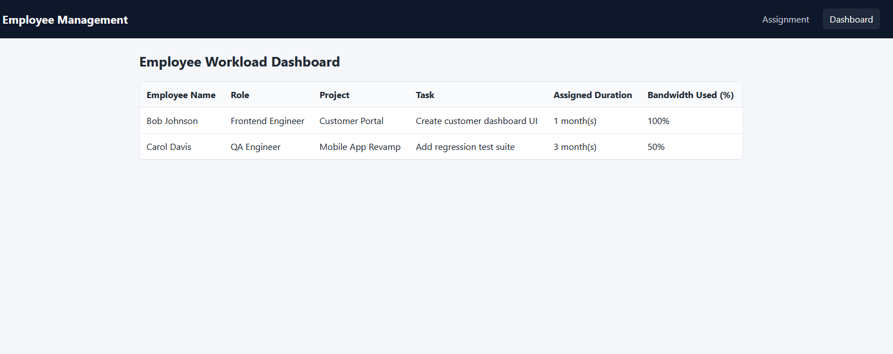
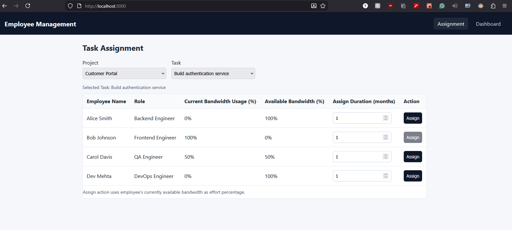
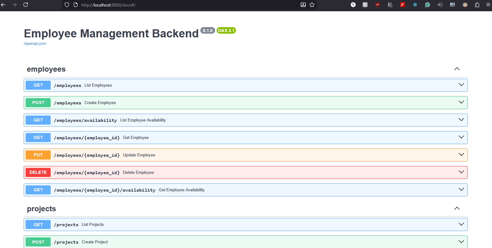
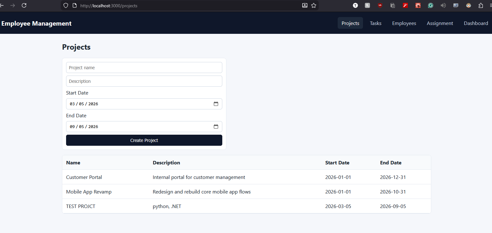
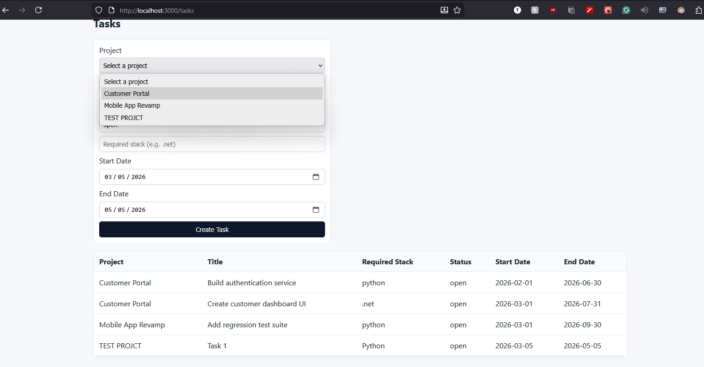
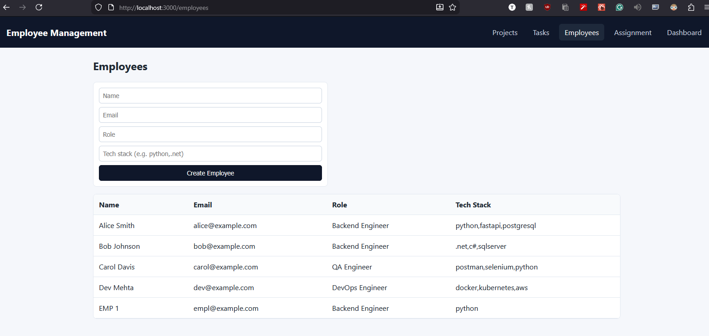

# Project Management POC

## Description

This is a Proof of Concept (POC) for an Employee Management System designed to help organizations manage projects, tasks, and employee assignments efficiently. It demonstrates a clean separation between backend services and a responsive frontend, showcasing how APIs can drive an interactive user interface for project planning and resource allocation.

Managers use the application to:

1. **Create and organize projects** – each project can contain multiple tasks representing work items or milestones.
2. **Define tasks** – tasks are the atomic units of work; they inherit their project context and act as the only entity employees can be assigned to.
3. **Add employees** – each employee record includes a technical role (e.g., Backend Engineer, Frontend Engineer, QA Engineer).
4. **Assign employees to tasks** – assignments specify a start date, duration (in months), and effort percentage, allowing tracking of utilization and availability.
5. **View dashboards** – interactive pages show overall project progress, task lists, and employee workload summaries.

The system enforces rules such as employees cannot be assigned directly to projects, only to tasks, promoting efficient resource allocation and better visibility into employee workloads.

This POC also highlights modular backend architecture with FastAPI routers, SQLAlchemy models, and Pydantic schemas. The frontend, built with React and TypeScript, consumes these APIs and renders data tables, forms, and dashboards. Containerization with Docker ensures that developers can start the entire stack quickly for local testing or demonstration.

## Use Case

Organizations running multiple projects need a structured way to allocate technical resources. This application enables:

- **Project Management**: Create and organize projects.
- **Task Definition**: Break down projects into manageable tasks.
- **Employee Assignment**: Assign employees to tasks based on their technical roles (e.g., Backend Engineer, Frontend Engineer, QA Engineer, etc.).
- **Duration Tracking**: Track assignment durations in months.
- **Resource Allocation**: Ensure employees are assigned to tasks only, not directly to projects, for clear ownership and workload visibility.

The system enforces rules such as employees cannot be assigned directly to projects, only to tasks, promoting efficient resource allocation and better visibility into employee workloads.

## Features

- Full-stack web application with containerized deployment.
- RESTful API backend built with FastAPI.
- React-based frontend with TypeScript.
- PostgreSQL database with SQLAlchemy ORM.
- Database migrations using Alembic.
- Docker Compose for easy local development and deployment.

## Current Status

### Built Features
- **Backend API**: Complete RESTful API with FastAPI for managing employees, projects, tasks, and assignments.
- **Database Models**: SQLAlchemy models for Employee, Project, Task, and Assignment with relationships.
- **Frontend UI**: React-based interface with pages for dashboard, assignments, and data tables.
- **Employee Management**: CRUD operations for employees with technical roles.
- **Project and Task Management**: Hierarchical structure with projects containing tasks.
- **Assignment System**: Assign employees to tasks with duration tracking and effort percentages.
- **Availability Calculation**: Logic to calculate employee availability based on current assignments.
- **Containerization**: Full Docker setup with Compose for easy deployment.
- **Database Seeding**: Automatic seeding of initial data on startup.

### In Progress / Future Enhancements
- **User Authentication**: Adding login/logout functionality for managers.
- **Advanced Filtering**: More sophisticated search and filter options in the UI.
- **Reporting**: Dashboards for project progress, resource utilization, and workload reports.
- **Notifications**: Alerts for assignment conflicts or upcoming task completions.
- **Testing**: Comprehensive unit and integration tests.
- **Production Deployment**: Configuration for cloud deployment (e.g., AWS, Heroku).

This POC validates the core architecture and workflows. Further development can build upon this foundation.

## Screenshots

### Employee Dashboard


This screenshot shows the main dashboard page where managers can view a list of employees, their roles, and manage employee data.

### Assignment Page


The assignment page displays current assignments, allowing managers to assign employees to specific tasks within projects, including setting durations in months.

### Backend API Documentation


Interactive API documentation generated by FastAPI's Swagger UI, providing endpoints for managing projects, tasks, employees, and assignments.

### Project Dashboard


This view lists all active projects, showing status and basic metadata, with links to drill into each project's tasks.

### Task Dashboard


A focused listing of tasks across projects; managers can create, edit, or assign tasks from here.

### Employee Dashboard (alternate)


An alternative employee view demonstrating UI variations.

## Tech Stack

### Backend
- Python 3
- FastAPI
- PostgreSQL
- SQLAlchemy
- Pydantic
- Alembic (for migrations)

### Frontend
- React
- TypeScript
- Vite
- Axios (for API calls)

### Infrastructure
- Docker & Docker Compose
- PostgreSQL

## AI Tools and Assistants Used

This project was developed with assistance from AI tools:

- **Code Writing**: OpenAI Model GPT-5.3-Codex was used for generating and assisting with code development.
- **Documentation**: VSCode was used for writing and editing documentation files.

## Prerequisites

- Docker and Docker Compose installed on your machine.
- (Optional) Node.js and npm for running frontend locally without Docker.

## Running Locally

### Using Docker Compose (Recommended)

1. Clone the repository:
   ```bash
   git clone <repository-url>
   cd project_management_poc
   ```

2. Ensure Docker and Docker Compose are installed and running.

3. Build and start the services:
   ```bash
   docker compose up --build
   ```

4. The application will be available at:
   - Frontend: http://localhost:3000
   - Backend API: http://localhost:8000
   - Database: localhost:5432 (accessible from host)

5. To stop the services:
   ```bash
   docker compose down
   ```

### Running Components Individually

#### Backend
1. Navigate to the backend directory:
   ```bash
   cd backend
   ```

2. Create and activate a virtual environment:
   ```bash
   python -m venv venv
   source venv/bin/activate  # On Windows: venv\Scripts\activate
   ```

3. Install dependencies:
   ```bash
   pip install -r requirements.txt
   ```

4. Copy `.env.example` to `.env` and update database URL if needed.

5. Run the application:
   ```bash
   uvicorn app.main:app --reload
   ```

#### Frontend
1. Navigate to the frontend directory:
   ```bash
   cd frontend
   ```

2. Install dependencies:
   ```bash
   npm install
   ```

3. Copy `.env.example` to `.env` and set the API URL (e.g., `VITE_API_URL=http://localhost:8000`).

4. Run the development server:
   ```bash
   npm run dev
   ```

## API Documentation

Once the backend is running, visit http://localhost:8000/docs for interactive API documentation (Swagger UI).

## Database Seeding

The project includes seed data that is automatically seeded on startup when using Docker Compose. The backend container runs database migrations followed by the seed script to populate initial data.

If running components individually, you can manually run the seed script after starting the backend:
```bash
cd backend
python scripts/run_seed.py
```

## Contributing

This is a POC project. For contributions, please follow standard practices and ensure Docker Compose setup works correctly.

## License

[Add license if applicable]